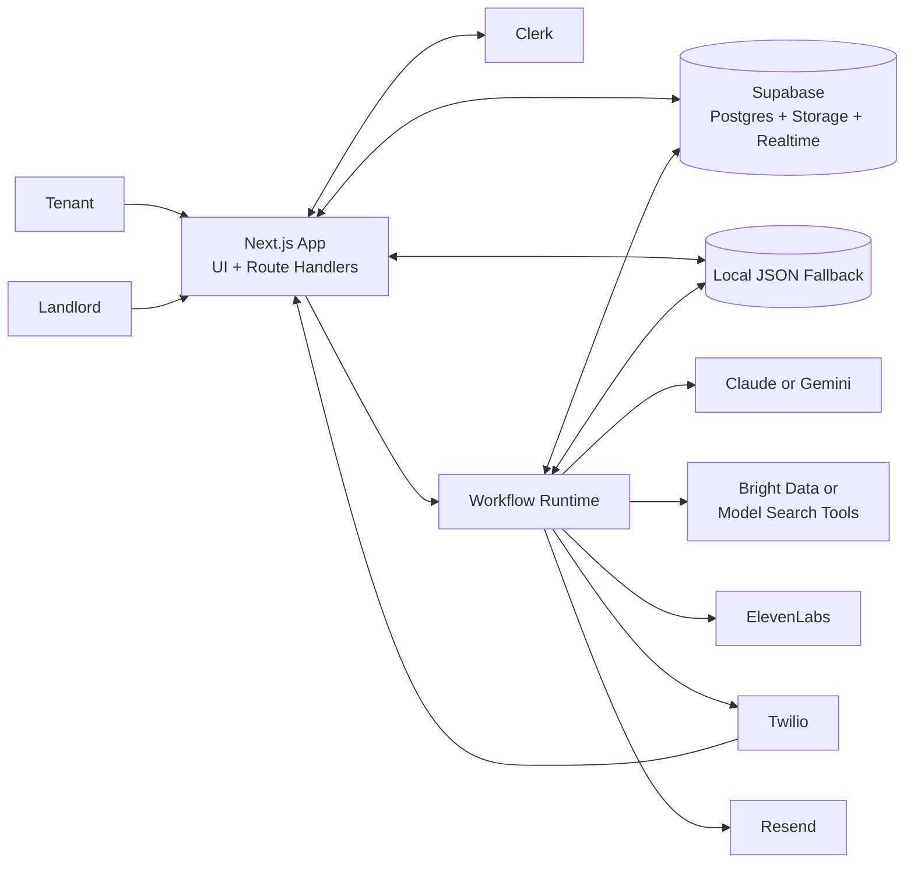
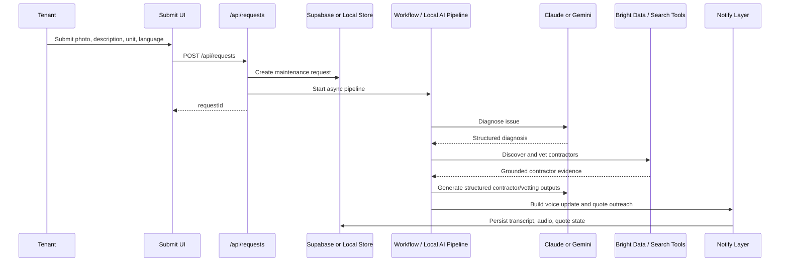
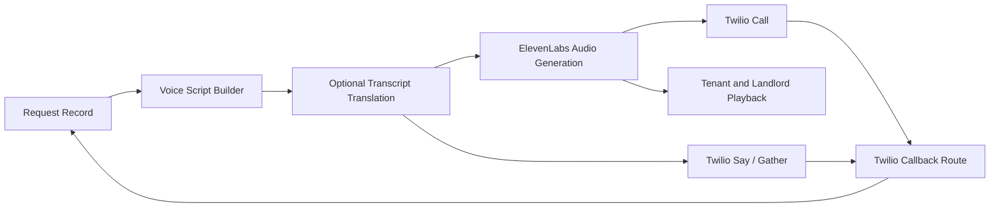

# System Architecture: FixFlow

## Overview

FixFlow is an AI-assisted property maintenance platform for tenants, landlords, and small property managers. It turns a tenant-submitted photo, description, and unit selection into a structured maintenance case with diagnosis, contractor recommendations, vetting, work-order output, and a voice update. The product’s main goal is to reduce the operational drag of manual triage by concentrating the workflow into one application and one durable request record.

Architecturally, FixFlow is a modular monolith built on Next.js 16. The user interface, route handlers, background workflow, AI orchestration, and communications logic live in a single codebase, while identity, storage, database, AI inference, retrieval, voice generation, and quote outreach are delegated to managed external services. This keeps iteration fast while still supporting asynchronous processing, provider substitution, and a workable local development path.

## Key Requirements

- Allow tenants to submit maintenance requests with a photo, unit selection, optional text, and browser voice input.
- Route users into tenant and landlord experiences based on authenticated role metadata.
- Diagnose issues from image and text input using a switchable AI provider.
- Discover and vet UK-based contractors using grounded web retrieval.
- Generate dispatch-ready work-order data and cost estimates for landlord review.
- Produce spoken voice updates and optionally request quotes via phone or email.
- Support multilingual voice-output transcripts based on the request language.
- Persist incremental pipeline state so both tenant and landlord views can reflect progress.
- Keep long-running AI and communications work outside the synchronous request lifecycle.
- Degrade gracefully when optional providers or the full Supabase schema are unavailable.
- Maintain clear server-side access control around tenant and landlord data.

## High-Level Architecture

FixFlow is organised around a single Next.js application using the App Router, route handlers, and the `workflow` runtime. Clerk provides authentication and role-based entry. Supabase provides the primary persistence layer for the real application path, including PostgreSQL tables, storage for uploaded photos and generated audio, and optional realtime feeds. When the real Supabase service path is unavailable in development, the application can switch into a local JSON-backed fallback mode so the end-to-end experience remains demoable.

The AI layer is separated into two concerns. Reasoning and structured generation are handled through the Vercel AI SDK with either Anthropic Claude or Google Gemini. Web-grounded contractor retrieval is handled either by model-native search tools or by Bright Data Discover, selected through configuration. Communications are handled through ElevenLabs for audio generation, Twilio for voice calls and speech capture, and Resend for outbound email.

This diagram shows the system as a modular monolith with replaceable service edges. The application itself owns the product flow and orchestration, while persistence, retrieval, AI reasoning, voice generation, and outbound communications are supplied by external platforms or a local fallback store depending on environment readiness.

## Component Details

### Web Client

**Responsibilities**

- Render the tenant submission flow and request detail pages.
- Render the landlord dashboard, property management UI, and approval flow.
- Capture images, typed descriptions, request language, and browser speech input.
- Poll for request progress where a clean realtime path is not available.

**Main technologies**

- Next.js 16 App Router
- React 19
- TypeScript
- Tailwind CSS 4
- Framer Motion

**Important data it owns**

- Transient form state such as selected unit, description, language, and upload status.
- Playback state for voice updates and request-detail rendering state.

**Communication**

- Calls internal routes such as `/api/requests`, `/api/requests/[id]`, `/api/units`, and `/api/properties`.
- Uses Clerk on the client and server to resolve the active user.

### API Layer and Route Handlers

**Responsibilities**

- Accept maintenance request submissions.
- Upload tenant photos and create the canonical request row.
- Expose authenticated read and update operations for requests, properties, and units.
- Provide internal workflow-facing endpoints for vetting, work-order generation, notifications, and Twilio callbacks.

**Main technologies**

- Next.js route handlers
- TypeScript
- Clerk server SDK
- Supabase server and service-role clients

**Important data it owns**

- Request creation payloads
- Access-control decisions
- Twilio webhook payloads
- Incremental request mutations written during the workflow

**Communication**

- Reads and writes Supabase when running in the real path.
- Delegates to local store helpers when running in fallback mode.
- Invokes AI helpers, workflow triggers, and communications providers.

### Workflow Orchestrator

**Responsibilities**

- Run the long-lived maintenance pipeline outside the original submission request.
- Sequence diagnosis, contractor discovery, vetting, work-order generation, and notification.
- Persist intermediate state and pipeline failures back to the request record.
- Handle internal timeouts and recoverable retry boundaries.

**Main technologies**

- `workflow`
- Step functions in `src/workflows/maintenance.ts`

**Important data it owns**

- Workflow step ordering
- Pipeline stage transitions
- Failure annotations such as `pipeline_error`

**Communication**

- Loads request context from Supabase or the local fallback store.
- Calls internal endpoints `/api/vet`, `/api/work-order`, and `/api/notify`.
- Calls the AI and retrieval layers through shared helper modules.

### AI and Retrieval Layer

**Responsibilities**

- Diagnose maintenance issues from submitted media and text.
- Generate structured contractor recommendations.
- Vet top contractors and produce grounded cost ranges.
- Generate work-order content and AI quote estimates.
- Translate voice-update transcripts into the selected request language when needed.

**Main technologies**

- Vercel AI SDK
- `@ai-sdk/anthropic`
- `@ai-sdk/google`
- Bright Data Discover API
- Zod-based structured outputs

**Important data it owns**

- Diagnosis JSON
- Contractor shortlist JSON
- Vetting JSON
- Quote-estimate JSON
- Translation payloads for voice transcripts

**Communication**

- Called from both the workflow path and the local live-AI path.
- Reads provider configuration from environment variables.
- Returns structured data that is written back into the request record.

### Data Platform

**Responsibilities**

- Persist the authoritative request aggregate in the real application path.
- Store uploaded maintenance photos and generated audio artefacts.
- Support landlord and tenant reads of the current request state.

**Main technologies**

- Supabase PostgreSQL
- Supabase Storage
- Supabase Realtime

**Important data it owns**

- `properties`
- `units`
- `maintenance_requests`
- Storage objects for photos and voice updates

**Communication**

- Accessed by browser-safe clients where appropriate.
- Accessed by trusted server code with service credentials for workflow and admin operations.

### Local Development Fallback

**Responsibilities**

- Preserve a usable demo and local development flow when the Supabase server key or schema is not ready.
- Store request, unit, and property state in a local JSON file.
- Run a local AI pipeline that mirrors the real request lifecycle closely enough for UI testing.

**Main technologies**

- File-backed JSON store in `.fixflow-local-dev-db.json`
- Local helper modules in `src/lib/local-dev-store.ts` and `src/lib/local-ai-pipeline.ts`

**Important data it owns**

- Local properties, units, and maintenance requests
- Locally persisted voice transcripts and data-URL audio
- Pipeline metadata such as language preference and quote state

**Communication**

- Used automatically when service-role Supabase access is unavailable in local development.
- Shares the same AI provider abstraction and much of the same contractor-intelligence logic as the real path.

### Identity and Access Control

**Responsibilities**

- Authenticate users.
- Distinguish tenant and landlord journeys.
- Protect request reads and writes based on ownership.

**Main technologies**

- Clerk middleware
- `auth()` and `currentUser()`

**Important data it owns**

- User identity
- Session state
- `publicMetadata.role`

**Communication**

- Server routes compare Clerk user IDs with request tenant IDs and property landlord IDs before returning or mutating sensitive records.

### Communications Layer

**Responsibilities**

- Generate spoken maintenance briefs.
- Place outbound quote-request calls.
- Capture spoken quote amounts where Twilio callbacks are available.
- Send quote-request emails.

**Main technologies**

- ElevenLabs text-to-speech API
- Twilio Voice and TwiML
- Resend email API

**Important data it owns**

- Voice scripts
- Audio URLs or data URLs
- Quote communication status
- Captured quote text and confidence metadata

**Communication**

- The notify route composes the spoken and emailed outbound payloads.
- Twilio callback routes feed quote data back into the request record.
- Voice output is surfaced through the tenant and landlord request detail views.

## Data Flow

### Maintenance Request Submission and Fulfilment

1. A tenant signs in through Clerk and opens `/submit`.
2. The client loads tenant-linked units from `/api/units`.
3. The tenant submits a photo, unit ID, optional description, and request language to `POST /api/requests`.
4. The route either writes to Supabase and triggers the workflow, or creates a local fallback request and starts the local AI pipeline.
5. Diagnosis runs first and stores severity, urgency, recommended action, and language metadata.
6. Contractor discovery and vetting enrich the same request with grounded shortlist and cost data.
7. Work-order generation and notification attach voice output, quote state, and optional communication results.
8. Tenant and landlord views read the same progressively enriched request record.

This sequence highlights the main architectural choice: the user request returns quickly, while the expensive AI and communications work runs asynchronously and writes progress back to shared storage.

### Quote Capture and Voice Update Flow

1. The system generates a voice script from the diagnosed issue and estimated cost range.
2. If the request language is not English, the transcript is translated before audio generation.
3. ElevenLabs generates audio when configured; otherwise the system degrades to a mock or text-only path.
4. Twilio optionally delivers the quote request by voice and can post spoken replies back into the system if a public HTTPS callback URL exists.

This flow matters because the voice path is both a user-facing output channel and a data-ingest path for contractor quote capture. The translation step sits before playback so the spoken and displayed transcript can align with the request language.

## Data Model (high-level)

The system revolves around a small set of aggregates.

- **Property**
  - A landlord-managed address or building.
  - Owns one or more units.

- **Unit**
  - A rentable unit within a property.
  - Optionally linked to a tenant through a Clerk user ID.

- **Maintenance Request**
  - The central aggregate.
  - Contains the original submission plus progressively added diagnosis, contractor, vetting, work-order, quote, and voice metadata.
  - Also stores request-language metadata used by the translation path.

- **Identity References**
  - Stored as Clerk user IDs rather than managed through Supabase Auth.

- **Media Artefacts**
  - Photos and generated voice audio are stored in Supabase Storage in the real path.
  - In local fallback mode, voice audio may be stored as a data URL in the local JSON store.

High-level relationships:

- One landlord manages many properties.
- One property contains many units.
- One unit can be linked to one active tenant at a time.
- One unit can have many maintenance requests.
- One maintenance request accumulates many derived artefacts over its lifecycle.

## Infrastructure & Deployment

FixFlow is designed to run primarily as a managed web deployment with managed service dependencies.

- **Application runtime**
  - Next.js application with route handlers and workflow integration.
  - Best fit is a Vercel-style deployment model, though the repository does not hard-code a single platform.

- **Persistence**
  - Supabase for relational data, object storage, and optional realtime.

- **Identity**
  - Clerk for session and role management.

- **AI and retrieval**
  - Anthropic Claude or Google Gemini for reasoning.
  - Bright Data Discover or provider-native search tools for retrieval.

- **Communications**
  - ElevenLabs, Twilio, and Resend as SaaS integrations.

### Environments

- **Development**
  - Runs locally with `npm run dev`.
  - Uses the project root `.env.local`.
  - Can operate in local fallback mode when Supabase server access is incomplete.
  - Twilio speech callbacks require a public HTTPS tunnel such as ngrok.

- **Staging**
  - Not explicitly defined in the repository today.
  - Recommended for validating workflow behaviour, provider switching, and communications integrations before production.

- **Production**
  - Public HTTPS deployment with real Supabase, Clerk, and enabled provider keys.
  - Best suited to a serverless or managed Node deployment model with secure environment-variable management.

## Scalability & Reliability

- Long-running AI and communications work is moved off the synchronous request path into a background workflow or local async pipeline.
- The application is largely stateless between requests, which suits horizontal scaling.
- The request aggregate is updated incrementally, which reduces total loss when later stages fail.
- Optional integrations degrade gracefully so the UI remains testable even when Twilio, Resend, or ElevenLabs are unavailable.
- Provider abstraction allows retrieval and reasoning services to be swapped without rewriting the entire workflow.

Current limits and risks:

- Several downstream stages remain sequential, so total latency is still bounded by the slowest provider.
- There is no separate queue or dead-letter system beyond the workflow runtime.
- Idempotency and retry behaviour around repeated submissions and webhooks can be improved.
- Some tenant views still rely on polling rather than a complete authenticated realtime strategy.
- The fallback store is useful for development but is not suitable for collaborative or production use.

## Security & Compliance

- Clerk protects authenticated routes and APIs.
- Request access is enforced server-side by comparing the active Clerk user against tenant ownership or landlord ownership of the related property.
- Supabase service-role usage is restricted to server code and workflow internals.
- Sensitive provider credentials are supplied through environment variables rather than embedded in client code.
- Twilio callbacks are expected to use public HTTPS endpoints in non-local scenarios.

Data protection considerations:

- The system processes personal and operational data such as names, phone numbers, property addresses, uploaded photos, and potentially spoken quote transcripts.
- No formal compliance framework is enforced in the repository today.
- If the system moves beyond prototype scope, retention policies, deletion workflows, supplier assessments, audit trails, and regional privacy obligations should be formalised.

## Observability

Observability is currently lightweight but serviceable for development.

- Route handlers and workflow steps log warnings and failures through `console` logging.
- Pipeline failures are persisted into the request record so the UI can display a user-visible error state.
- Request pages expose enough pipeline metadata to make manual debugging possible.
- Supabase realtime can support prompt landlord-facing refreshes where enabled.

Current gaps:

- No central log aggregation
- No dedicated metrics or alerting
- No distributed tracing or correlation IDs
- Limited provider-specific operational dashboards inside the app

## Trade-offs & Decisions

### Design Decisions

- **Modular monolith over microservices**
  - One Next.js codebase keeps the product easier to evolve while the domain is still moving quickly.

- **Provider abstraction over hard vendor lock-in**
  - AI reasoning and retrieval are configurable, which improves resilience and experimentation at the cost of some integration complexity.

- **Durable workflow over synchronous orchestration**
  - The background workflow boundary is necessary because diagnosis, retrieval, translation, TTS, and vendor callbacks do not fit neatly within a single request budget.

- **JSON-heavy enrichment model**
  - Diagnosis, contractor, vetting, and quote artefacts are stored as structured JSON to support rapid iteration, even though this makes reporting and long-term schema governance harder.

- **Built-in local fallback mode**
  - The local fallback store keeps development and demos productive, but it creates a second execution path that must be kept aligned with the real system.

- **Translated voice output before playback**
  - Translating the transcript prior to audio generation improves tenant comprehension, but it introduces another provider dependency and another place where content can diverge from the original English reasoning output.

## Future Improvements

- Add first-class database migrations and generated types for the real Supabase schema.
- Replace the current status and patch model with a single explicit state machine shared by the UI, API, and workflow.
- Expand localisation beyond voice output into a broader UI translation strategy.
- Add structured logging, metrics, tracing, and alerting.
- Improve webhook idempotency, retry handling, and failure recovery.
- Introduce stronger staging infrastructure and deployment automation.
- Add audit trails for approvals, contractor selection changes, and outbound communications.
- Reduce polling by introducing a cleaner authenticated realtime strategy for tenant views.
- Separate more reporting-friendly data into relational structures once the domain stabilises.
